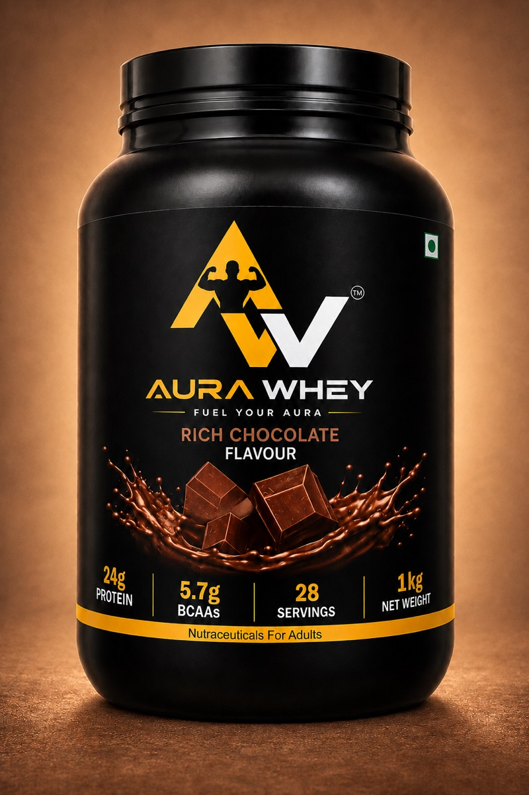

# Aura Whey Storefront

<p align="center">
  
</p>

<p align="center">
  A responsive, accessible storefront for Aura Whey Protein, featuring Mawa Kulfi and Rich Chocolate flavours.
</p>


## Overview

Aura Whey Storefront is a mobile-first static commerce experience built with semantic HTML, modern CSS, and vanilla JavaScript. It presents the Aura Whey product range, product details, quality documentation, pack authentication, order tracking, shopping cart, FAQs, journal content, and a checkout handoff in one fast hash-routed application.

The project deliberately avoids a heavy runtime framework. The browser loads one HTML entry point, one stylesheet, and one application script, while optimized responsive images reduce unnecessary transfer size on mobile connections.

## Products

| Mawa Kulfi | Rich Chocolate |
| --- | --- |
|  |  |
| Creamy, kulfi-inspired flavour profile | Deep, classic chocolate flavour profile |
| 1 kg · 28 servings | 1 kg · 28 servings |
| 24 g protein per 35 g serving | 24 g protein per 35 g serving |

Always use the product pack as the authoritative source for ingredients, allergens, preparation, storage, nutrition, and best-before information.

## Key Features

- Five-slide promotional hero carousel with automatic rotation, previous/next controls, touch swiping, responsive image sources, and reduced-motion support.
- Responsive product cards and product galleries for Mawa Kulfi and Rich Chocolate.
- Multi-product shopping cart with independent quantities for each flavour.
- Combined cart totals, item count, line removal, and `DISC5` coupon calculation.
- Product nutrition summary and flavour-specific presentation.
- Quality and certification document library interface.
- Pack authentication demonstration flow.
- Order-tracking demonstration flow.
- Store search, customer-account, contact, policy, journal, and FAQ views.
- Dark and light themes with persisted appearance preference.
- Accessible mobile navigation with focus management, Escape-key support, and an inert page overlay.
- Safe-area spacing for modern phones and large touch targets for coarse-pointer devices.
- Optimized desktop and mobile images with reserved dimensions to reduce layout shifts.

## Current Project Snapshot

<!-- AUTO-GENERATED:START -->
| Metric | Current value |
| --- | ---: |
| Storefront routes | 15 |
| Product flavours | 2 |
| Hero slides | 5 |
| FAQs | 12 |
| Automated tests | 15 |
| Optimized production images | 23 |
| Active JavaScript and CSS lines | 1,355 |

_README snapshot refreshed on 9 September 2026 at 5:51:46 pm IST._
<!-- AUTO-GENERATED:END -->

## Technology

| Area | Implementation |
| --- | --- |
| Markup | HTML5 |
| Styling | CSS custom properties, Grid, Flexbox, fluid sizing, and media queries |
| Application | Vanilla JavaScript with hash-based routing |
| Fonts | Montserrat and Plus Jakarta Sans through Google Fonts |
| Tests | Node.js built-in test runner and VM-based template tests |
| Build | Dependency-free Node.js static build script |
| Output | Static files in `dist/` |

## Routes

The application uses hash routes so it can run from a simple static web server without server-side route rewrites.

| Route | Purpose |
| --- | --- |
| `#/home` | Homepage, hero promotions, product cards, nutrition, quality, journal, and FAQ preview |
| `#/shop` | Product gallery, flavour selection, product details, and add-to-cart action |
| `#/cart` | Multi-product cart, quantities, coupon, and order summary |
| `#/checkout` | Secure checkout integration handoff |
| `#/quality` | Manufacturing and food-safety document library |
| `#/authenticate` | Product-pack code verification interface |
| `#/track-order` | Order lookup interface |
| `#/faq` | Complete FAQ collection |
| `#/blog` | Aura Whey journal index |
| `#/article` | Journal article view |
| `#/search` | Store search interface |
| `#/account` | Customer sign-in interface |
| `#/contact` | Customer-support form |
| `#/policy` | Shipping, returns, and privacy summaries |

## Project Structure

```text
AURA-WHEY-main/
├── index.html                  # Browser entry point and metadata
├── app.js                      # Active storefront templates, state, routes, and actions
├── styles.css                  # Theme, components, and responsive layout
├── assets/
│   ├── aura-whey-logo.jpeg     # Primary brand logo
│   └── optimized/              # Production hero and product images
├── src/                        # Modular source representation of the storefront
├── scripts/
│   ├── build.mjs               # Creates the production static build
│   └── update-readme.mjs       # Refreshes the generated README snapshot
├── tests/
│   ├── product-cards.test.cjs  # Product, gallery, cart, and FAQ tests
│   └── responsive.test.cjs     # Responsive, asset, navigation, and hero tests
├── .githooks/
│   └── pre-commit              # Updates and stages README.md before a commit
├── package.json                # Project commands
└── dist/                       # Generated production output; excluded from Git
```

The root `app.js` is the script currently loaded by `index.html`. The `src/` directory mirrors the modular component structure and should remain synchronized when storefront behaviour is changed.

## Requirements

- Git
- Node.js 18 or newer
- A modern browser
- Python 3 or another local static file server for previewing

There are no third-party JavaScript package dependencies to install.

## Local Setup

Clone the repository and enter the project directory:

```bash
git clone https://github.com/DineshDhanoki/AURA-WHEY.git
cd AURA-WHEY
```

Start a local server:

```bash
python3 -m http.server 5500
```

Open the storefront:

```text
http://127.0.0.1:5500/#/home
```

Opening `index.html` directly is not recommended because a local HTTP server more accurately represents production asset loading and navigation.

## Available Commands

| Command | Description |
| --- | --- |
| `npm test` | Runs all Node.js tests |
| `npm run check` | Checks `app.js` syntax and runs the complete test suite |
| `npm run build` | Recreates the static production build in `dist/` |
| `npm run readme:update` | Refreshes the generated project snapshot in this README |

## Validation

Before committing a storefront change, run:

```bash
npm run check
npm run build
```

The automated tests cover:

- Both product cards and all five product images per flavour.
- Add-to-cart behaviour and correct selected flavour.
- Simultaneous Rich Chocolate and Mawa Kulfi cart lines.
- Independent cart quantities, removal, totals, and coupon calculation.
- Product-gallery selected state.
- Homepage product and FAQ rendering.
- Accessible mobile menu state and keyboard handling.
- Mobile viewport metadata and responsive hero preloads.
- Phone, tablet, landscape, safe-area, reduced-motion, and touch CSS coverage.
- Optimized image availability and asset-size limits.
- Hero aspect ratio, non-cropping behaviour, and directional controls.
- Ultra-wide and browser zoom-out product layouts.

## Responsive Behaviour

The interface is designed for common phone, tablet, laptop, desktop, and ultra-wide viewport sizes. Important responsive tiers include approximately 320px, 360px, 375px, 390px, 414px, 480px, 640px, 768px, 900px, 1360px, and ultra-wide layouts above 2400px.

Responsive implementation details include:

- Flexible grids that collapse from multiple columns to a single column.
- A desktop navigation bar that becomes an accessible slide-out menu.
- Fluid typography and section spacing.
- Product names and prices that wrap without breaking the layout.
- Full-width mobile buttons and touch targets of at least 44px.
- Safe-area insets for devices with display cutouts and home indicators.
- Landscape-phone height constraints.
- Responsive 960px and 1920px hero sources.
- Complete, uncropped hero artwork at its supplied aspect ratio.
- An ultra-wide content tier that avoids undersized cards and excessive unused space.

## Accessibility

- Semantic navigation, sections, headings, forms, buttons, and links.
- A skip link for keyboard users.
- Visible focus indicators.
- Accessible names for icon-only controls.
- Keyboard-operable product galleries and FAQ accordions.
- Focus trapping and Escape-key dismissal in the mobile menu.
- Accurate `aria-expanded`, `aria-hidden`, `aria-pressed`, and cart-count labels.
- Reduced animation when `prefers-reduced-motion` is enabled.
- Readable light and dark colour themes.

## Performance

Production images are stored in `assets/optimized/`. The first hero image is preloaded according to viewport width, while later carousel and content images are lazy-loaded. Image width and height attributes reserve layout space before downloads complete.

The build script copies only the files needed by the production storefront:

```bash
npm run build
```

The resulting `dist/` directory can be served by any static hosting platform.

## GitHub Pages

Because the storefront uses hash routing, it can be hosted directly from the repository root:

1. Push the repository to GitHub.
2. Open the repository’s **Settings**.
3. Select **Pages**.
4. Under **Build and deployment**, select **Deploy from a branch**.
5. Select the `main` branch and `/ (root)` folder.
6. Save and wait for the deployment to finish.

The published address will normally follow this format:

```text
https://dineshdhanoki.github.io/AURA-WHEY/
```

## Automatic README Updates

This repository includes a versioned pre-commit hook. Before every commit, it runs `scripts/update-readme.mjs`, refreshes the generated snapshot, and stages `README.md`. Therefore, the refreshed README is included in the same commit that is pushed to GitHub.

Enable the hook once in each fresh clone:

```bash
git config core.hooksPath .githooks
```

You can also refresh the generated section manually:

```bash
npm run readme:update
```

The updater owns only the content between the `AUTO-GENERATED` markers. All other README content remains manually editable.

## Development Workflow

```bash
# Make and validate changes
npm run check
npm run build

# Review changed files
git status
git diff

# Commit; the README hook runs automatically
git add .
git commit -m "Describe the storefront update"

# Push to GitHub
git push
```

## Integration Status

The storefront interface is complete as a static frontend. The following production services still require real Shopify or backend credentials and endpoints:

- Checkout creation and redirect.
- Customer-account authentication.
- Live order tracking.
- Persistent server-side cart synchronization across devices.
- Production pack-authentication records.
- Contact-form delivery.
- Final certificate PDF files and approved legal policy text.

Never commit private keys, access tokens, passwords, customer information, or production credentials to the repository.

## Brand and Content Maintenance

- Preserve the Aura Whey logo proportions and do not stretch the artwork.
- Use the optimized asset directory for production images.
- Keep product nutrition statements aligned with the current physical label.
- Update both active root files and their modular equivalents when changing shared behaviour.
- Run the complete validation workflow after modifying routes, cart behaviour, responsive rules, or images.

## Licence

No open-source licence is currently included. All source code, branding, product imagery, and written content remain reserved unless the repository owner specifies otherwise.
