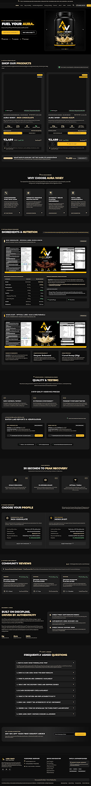

# Aura Whey

Aura Whey is a premium sports-nutrition storefront built as a lightweight, framework-free web application. It includes product browsing, cart and checkout interactions, customer-account hooks, order tracking, delivery checks, and a review experience.



## Getting started

Install dependencies and start the local development server:

```bash
npm install
npm run dev
```

The storefront is then available at the local URL printed by the server (port `4173` by default).

## Commands

```bash
npm run dev    # serve the storefront locally
npm test       # run the Node test suite
npm run check  # validate JavaScript syntax and run tests
npm run build  # create the deployable static output in dist/
```

## Configuration

Copy `.env.example` to a local `.env` file and provide only the integrations you need. The available settings cover:

- Shiprocket delivery checks and order cancellation
- Shopify storefront and customer-account authentication
- Supabase-backed product reviews

Keep production credentials server-side. Do not commit API passwords, service-role keys, session secrets, or customer-account secrets.

## Project structure

```text
api/        Serverless endpoints for order tracking and cancellation
assets/     Product, brand, and certification assets
docs/       Integration, performance, and frontend documentation
scripts/    Development, build, optimization, and verification tools
tests/      Node-based regression tests
dist/       Generated static deployment output
```

The main storefront files live at the repository root: `index.html`, `styles.css`, `app.js`, `product-viewer.js`, and `shopify.js`.

## Deployment

The repository includes `vercel.json` for static asset caching and client-side route rewrites. Run `npm run build` before deploying the generated `dist/` directory, and configure required environment variables in the deployment provider rather than in client-side files.

## Development workflow

The storefront is intentionally kept framework-free so the public shopping
surface stays small and easy to deploy. When changing a product flow, verify
both the direct page route and the homepage experience, then test the same
interaction at a narrow mobile width. Keep generated files in `dist/` aligned
with the source build when the deployment workflow requires committed output.

Before opening a pull request:

1. Run `npm run check`.
2. Run `npm run build` for changes that affect the storefront or assets.
3. Describe any required environment variables and manual browser checks.

## Additional documentation

- [Frontend structure](docs/FRONTEND_STRUCTURE.md)
- [Performance notes](docs/PERFORMANCE.md)
- [Shiprocket delivery checks](docs/SHIPROCKET.md)
